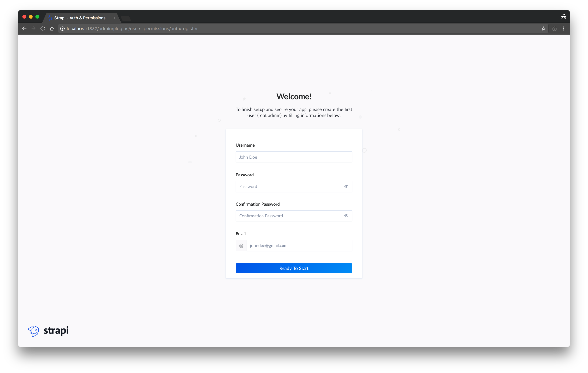
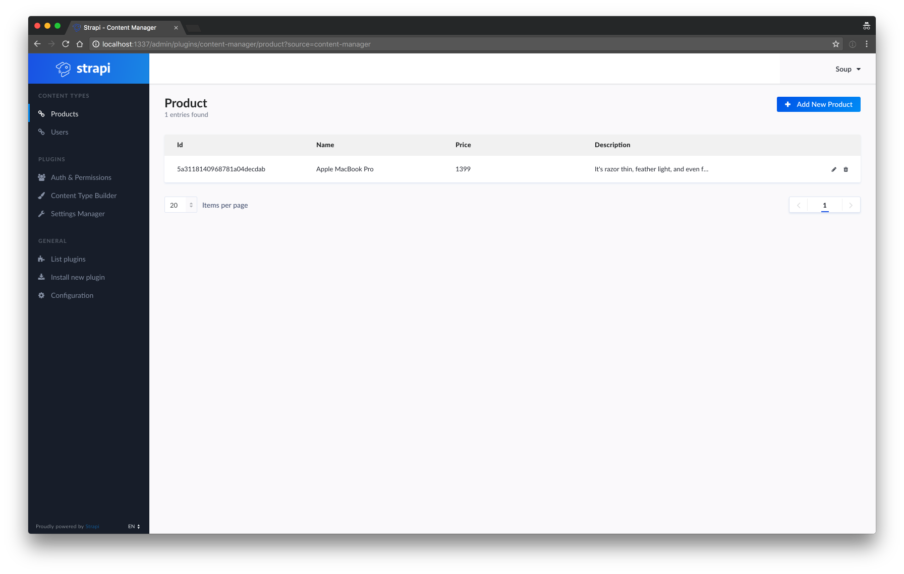

# Quick start

This section explains how to handle Strapi for the first time, ([check out our tutorial video](https://www.youtube.com/watch?v=yMl5IcFHA74)).

**Table of contents:**
- [Create your first project](#create-your-first-project)
- [Create your first API](#create-your-first-api)
  - [Content Type Builder plugin](#content-type-builder-plugin)
  - [Files structure](#files-structure)
- [Manage your data](#manage-your-data)
  - [Content Manager Plugin](#content-manager-plugin)
  - [Create a product](#create-a-product)
  - [Edit a product](#edit-a-product)
  - [Delete a product](#delete-a-product)
- [Consume your API](#consume-your-api)
  - [List entries](#list-entries)
  - [Get a specific entry](#get-a-specific-entry)
  - [Create data (POST)](#create-data-post)
  - [Update data (PUT)](#update-data-put)
  - [Delete data (DELETE)](#delete-data-delete)

***

## Create your first project

Creating your first project with Strapi is easy:

**#1 — Open your terminal**

Open your terminal in the directory you want to create your application in.

**#2 — Run the following command line in your terminal:**

```bash
strapi new my-project
```


This action creates a new folder named `my-project` with the entire [files structure](../concepts/concepts.md#files-structure) of a Strapi application.

**#3 — Go to your project and launch the server:**

In your terminal run the following commands:

```bash
cd my-project
strapi start
```


Now that your app is running let's see how to [create your first user](#create-your-first-user).

***

## Create your first user

In order to use the admin panel and to consume your API you first need to register your first user. This process only happens once if you don't have any user table created and is made to create the `admin user` that has all the permissions granted for your API.

If your using MongoDB for your database you don't have to create your table manually (it's already handled by Strapi) otherwise you'll have to create your user table first.

To create your first user, start your server (`strapi start`) and go to : http://localhost:1337/admin/plugins/users-permissions/auth/register.




Now that your first user is registered let's see how to [create your first api](#create-your-first-api).
***
## Create your first API

To create your first API, start your server (`strapi start`) and go to : http://localhost:1337/admin.

At this point, your application is empty. To create your first API is to use the **Content Type Builder** plugin: a powerful UI to help you create an API in a few clicks. Let's take the example of an e-commerce API, which manages products.

**#1 —** Go to the **Content Type Builder** plugin.


**#2 —** Create a Content Type name `Product` and submit the form.


**#3 —** Add three fields in this Content Type.

  - A `string` field named `name`.
  - A `text` field named `description`.
  - A `number` field named `price` (with `float` as number format).


**#4 —** Save. That's it!


> Note: See the [CLI documentation](../cli/CLI.md#strapi-generateapi) for informations about how to do it the hacker way.

### Files structure

A new directory has been created in the `./api` folder of your application which contains all the needed stuff for your `Product` Content Type: routes, controllers, services and models. Take a look at the [API structure documentation](../concepts/concepts.md#files-structure) for more informations.


**Well done, you created your first API using Strapi!**

***

## Manage your data

After creating [your first Content Type](#create-your-first-api), it would be great to be able to create, edit or delete entries.

**#1 —** Go to the [**Product list**](http://localhost:1337/admin/plugins/content-manager/product/) by clicking on the link in the left menu (generated by the **Content Manager** plugin).


**#2 —** Click on the button `Add New Product` and fill the form.


**#3 —** Save! You can edit or delete this entry by clicking on the icons at the right of the row.



***

## Consume your API

Your API is now ready and [contains data](#manage-your-data). At this point, you'll probably want to use this data in mobile or desktop applications.
In order to do so, you'll need to allow access to other users (identified as 'Guest').

**1 -** Go to the [**Auth & Permissions View**](http://localhost:1337/admin/plugins/users-permissions/roles) by clicking on **Auth & Permissions** link in the left menu and click on the **Guest Role** item.


**2 -** Manage your APIs permissions in the **Permissions** section of the [**Edit Guest Role view**](http://localhost:1337/admin/plugins/users-permissions/roles/edit/1) by enabling or disabling specific actions.


### List entries (GET)

To retrieve the list of products, use the `GET /your-content-type` route.

Generated APIs provide a handy way to filter and order queries. In that way, ordering products by price is as easy as `GET http://localhost:1337/product?_order=price:asc`. For more informations, read the [filters documentation](../guides/filters.md)

Here is an example using jQuery.

```js
$.ajax({
  type: 'GET',
  url: 'http://localhost:1337/product?_order=price:asc', // Order by price.
  done: function(products) {
    console.log('Well done, here is the list of products: ', products);
  },
  fail: function(error) {
    console.log('An error occurred:', error);
  }
});
```

### Get a specific entry (GET)

If you want to get a specific entry, add the `id` of the wanted product at the end of the url.

```js
$.ajax({
  type: 'GET',
  url: 'http://localhost:1337/product/123', // Where `123` is the `id` of the product.
  done: function(product) {
    console.log('Well done, here is the product having the `id` 123: ', product);
  },
  fail: function(error) {
    console.log('An error occurred:', error);
  }
});
```

### Create data (POST)

Use the `POST` route to create a new entry.

jQuery example:

```js
$.ajax({
  type: 'POST',
  url: 'http://localhost:1337/product',
  data: {
    name: 'Cheese cake',
    description: 'Chocolate cheese cake with ice cream',
    price: 5
  },
  done: function(product) {
    console.log('Congrats, your product has been successfully created: ', product); // Remember the product `id` for the next steps.
  },
  fail: function(error) {
    console.log('An error occurred:', error);
  }
});
```

### Update data (PUT)

Use the `PUT` route to update an existing entry.

jQuery example:

```js
$.ajax({
  type: 'PUT',
  url: 'http://localhost:1337/product/123', // Where `123` is the `id` of the product.
  data: {
    description: 'This is the new description'
  },
  done: function(product) {
    console.log('Congrats, your product has been successfully updated: ', product.description);
  },
  fail: function(error) {
    console.log('An error occurred:', error);
  }
});
```

### Delete data (DELETE)

Use the `DELETE` route to delete an existing entry.

jQuery example:

```js
$.ajax({
  type: 'DELETE',
  url: 'http://localhost:1337/product/123', // Where `123` is the `id` of the product.
  done: function(product) {
    console.log('Congrats, your product has been successfully deleted: ', product);
  },
  fail: function(error) {
    console.log('An error occurred:', error);
  }
});
```

***

Congratulations! You successfully finished the Getting Started guide! Read the [concepts](../concepts/concepts.md) to understand more advanced concepts.

Also, feel free to join the community thanks to the different channels listed in the [community page](http://strapi.io/community): team members, contributors and developers will be happy to help you.
